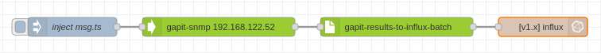

# node-red-contrib-gabit-snmp

The *gapit-snmp* <a href="http://nodered.org" target="_new">Node-RED</a> 
node queries all the OIDs listed in a *Gapit code* JSON structure using 
SNMP get. The *Gapit code* structures and names data, preparing it for 
insertion into a database. The complementary *gapit-results-to-influx-batch* 
node transforms the output of this node to the format required by the 
*influx batch* node (from `node-red-contrib-influxdb`).

So to fetch a standard set of data and insert it into InfluxDB, a flow 
like this is all you need:



Here's a fragment of a *Gapit code* for UPSes:

```json
{
    "objects": [
        {
            "group_name": "Battery",
            "read_priority": 0,
            "group": [
                {
                    "description": "Battery status",
                    "byte_type": "INT",
                    "address": "1.3.6.1.2.1.33.1.2.1.0",
                    "scaling_factor": 1,
                    "unit": "1=Unknown, 2=Ok, 3=Low, 4=Depleted"
                },
                {
                    "description": "Seconds on battery",
                    "byte_type": "INT",
                    "address": "1.3.6.1.2.1.33.1.2.2.0",
                    "scaling_factor": 1,
                    "unit": "sec"
                }
            ]
        }
    ]
}
```

This would get inserted into a InfluxDB measurement called "Battery" (from the *group_name* field), 
with fields called "Battery status" and "Seconds on battery" (from the *description* field).

The output of `gapit-snmp`, which is parsed by `gapit-results-to-influx-batch`, 
is `msg.gapit_results`. This has the same structure as the *Gapit code*, 
except with `.value` added for each OID.

### Other destinations/databases?

If you want to insert the data into a different database, you can parse 
the `msg.gapit_results` structure, and transform it into the required 
format.

### gapit-results-to-influx-batch node

The gapit-results-to-influx-batch node is packaged as a separate module, 
`node-red-contrib-gapit-results`, which is automatically installed with 
this module. It is a packaged as a separate module to enable sharing with 
other nodes which yield results in the same `msg.gapit_results` structure.

The `node-red-contrib-gapit-results` module may be expanded with new 
nodes in the future.


## Installation

### Install from the Node-RED interface

Install using *Manage palette* -> *Install*.

You need to refresh your browser for the `gapit-results-to-influx-batch` 
node to be available in the node palette. If you are running Node-RED 1.2 
or older, you will need to restart Node-RED for it to be visible.

If you are an ancient version of NPM, you will need to manually install 
`node-red-contrib-gapit-results`.

### Install using the command line

Run the following command in your Node-RED user directory - typically `~/.node-red`

    npm install @gapit/node-red-contrib-gapit-snmp

and then restart Node-RED.


## Usage

### Example flow

This is the JSON for the flow pictured above.

```json
[{"id":"18636adc.5ff2c5","type":"tab","label":"Flow 1","disabled":false,"info":""},{"id":"e9fbc788.fe6a28","type":"inject","z":"18636adc.5ff2c5","name":"inject msg.ts","props":[{"p":"ts","v":"","vt":"date"}],"repeat":"","crontab":"","once":false,"onceDelay":0.1,"topic":"","x":170,"y":180,"wires":[["2216c2a5.f7ae6e"]]},{"id":"2216c2a5.f7ae6e","type":"gapit-snmp","z":"18636adc.5ff2c5","host":"192.168.122.52","community":"eaton-9PX-partial-walk","version":"1","tagname_device_name":"devname","tagvalue_device_name":"ups1","minion_ids":"","custom_tags":"{\"floor\":\"1\",\"room\":\"101\"}","gapit_code":"{\"objects\":[{\"group_name\":\"Battery\",\"read_priority\":20,\"next_read\":0,\"group\":[{\"description\":\"Flarb\",\"value\":\"f\",\"byte_type\":\"INT\",\"address\":\"1.3.6.1.4.1.534.1.4.7.0\",\"scaling_factor\":1,\"unit\":\"1=Unknow, 2=Ok, 3=Low, 4=Depleted\"},{\"description\":\"Flarb the Second\",\"value\":\"f\",\"byte_type\":\"INT\",\"address\":\"1.3.6.1.4.1.534.1.2.1.0\",\"scaling_factor\":1,\"unit\":\"1=Unknow, 2=Ok, 3=Low, 4=Depleted\"}]}]}","scaling":"general","skip_nonexistent_oids":true,"remove_novalue_items_from_gapit_results":true,"timeout":5,"name":"","x":400,"y":180,"wires":[["48874c94.c9c534"]]},{"id":"48874c94.c9c534","type":"gapit-results-to-influx-batch","z":"18636adc.5ff2c5","use_timestamp_from_msg":true,"timestamp_property":"ts","name":"","x":680,"y":180,"wires":[["f23c3400.74ae98"]]},{"id":"f23c3400.74ae98","type":"influxdb batch","z":"18636adc.5ff2c5","influxdb":"2aa4b01d.f511f","precision":"ms","retentionPolicy":"","name":"","database":"database","precisionV18FluxV20":"ms","retentionPolicyV18Flux":"","org":"organisation","bucket":"bucket","x":910,"y":180,"wires":[]},{"id":"2aa4b01d.f511f","type":"influxdb","hostname":"influx","port":"8086","protocol":"http","database":"db1","name":"influx","usetls":false,"tls":"","influxdbVersion":"1.x","url":"http://localhost:8086","rejectUnauthorized":true}]
```

### Gapit codes

A library of ready-made *gapit codes* is forthcoming.

### gapit-snmp

The node needs to be configured with, at a minimum:

* SNMP config (host, community, etc.)
* Gapit code

| Parameter | Description |
| ------ | ------ |
| Name | Node name |
| Host | SNMP host |
| Community | SNMP community |
| Version | SNMP version |
| Timeout | SNMP timeout |
| Device name | The device name database records will be tagged with (e.g. "ups1")|
| Device name db-tag | The database tag for device name (e.g. "devname") |
| Minion IDs | A list of minion IDs, see below |
| Custom tags | Extra tags to add to database records, see below |
| Gapit code | The Gapit code JSON |
| Scaling | *General* or *Schleifenbauer* |
| Skip nonexistent OIDs in subsequent queries | If an OID generates a "doesn't exist" error, stop querying it (*default on*) |
| Remove items with no value from gapit_results | If checked, only those items where a value was returned is represented in `msg.gapit_results` (*default on*) |


#### Minion IDs

Using an SNMP bridge device, it is possible to query multiple devices 
"behind" the bridge. The bridges represent these devices using a variable 
ID as part of the OID, e.g. 1.2.3.4.x.1, and some *Gapit codes* are set 
up for this. Specify your device IDs in the *Minion IDs* field, separated by 
semicolons (**;**). If you specify more than one *Minion IDs*, the *Device 
name* field must have an equal number of names, also semicolon separated.

#### Custom tags

Add database tags, formatted as JSON with `tag_name: value`. If multiple minions are specified, tags must be in a child object named for the device name, or "all-minion-tags" for any tags that should be common for all minions.

Example:

```json
{
    "floor": "1",
    "room": "101"
}
```

### gapit-results-to-influx-batch

To use a Node-RED timestamp with influxdb (enabled by default), 
add a property containing a timestamp in your inject node. The 
default name is `msg.ts`.

| Parameter | Description |
| ------ | ------ |
| Name | Node name |
| Use timestamp from Message | Use a timestamp injected in the flow (*default on*) |
| Timestamp property | The `msg` property to get the timestamp from (*default: "ts"*) |

#### N.B.! Check the InfluxDB time precision

If using timestamps from Node-RED, note that while this works "out-of-the-box" 
with InfluxDB v2, you will have to set the `influx batch` node to match the 
millisecond resolution of Node-RED if you're using InfluxDB v1. You can do this 
by checking `Advanced Query Options` on the `influx batch` node, and then 
choosing `Milliseconds (ms)` from the `Time Precision` popup menu.
